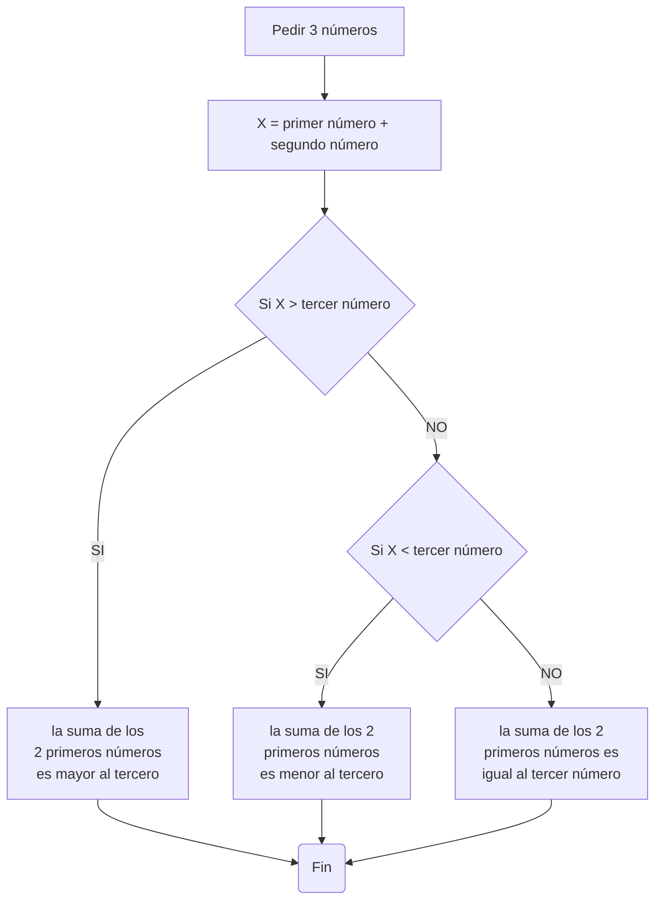

# Taller-No1

## Grupo: CoD3

### Integrantes:

David Alejandro Sotelo Pinzón

David Santiago Hoyos Mateus

Diego Garcés Torres

### 1. Realice el quiz *Python Beginner Quiz* (20 preguntas) y adjunte pantallazo con el resultado (mínimo 90% bien).

[](https://postimg.cc/9D1MXKxs)

### 2. Realice un programa que lea tres números reales y determine cuál es el mayor.

```python
n=int
m=int
r=int

n = int(input("Escriba el primer número "))
m = int(input("Escriba el segundo número "))
r = int(input("Escriba el tercer número "))

if n>m>r or n>r>m:
    print("El número mayor es " + str(n))

elif m>n>r or m>r>n:
    print("El número mayor es " + str(m))

elif r>m>n or r>n>m:
    print("El número mayor es " + str(r))

else:
    print("Los números son iguales")
```
#### Explicación de la solución

*primeramente se especifica el tipo de variable en las 3 variables (enteros), y despues se piden los 3 números. El siguiente paso fue con 3 condicionales evaluar cual número de los 3 era el mayor utilizando tambien 
operadores lógicos y por último tener en cuenta el caso en el que los 3 números sean iguales.

### 3. Realice un programa que lea un número enteros y determine si es par o impar.

```python
x : int = int((input("ingrese un numero para determinar si es par o impar: ")))
if x%2 == 0:
    print(x, " es par")
elif x%2 != 0:
    print(x, " es impar")
```

#### Explicación de la solución

se solicita al usuario que ingrece un numero, se divide entre 2 y si el residuo es igual a 0, entonces el numero es par y se muestra el mensaje para pares, en caso contrario se muestra el mensjae para impares

### 4. Realice un programa que lea dos números reales y determine si el primero es múltiplo del segundo.

```python
print("ingrese un numero para determinar si es multiplo de un segundo numero")
x : float = float(input("ingrese un numero: "))
y : float = float(input("ingrese un numero: "))
if x%y==0:
    print(x, " es multiplo de ", y)
else:
    print(x, " no es multiplo de ", y)
```

#### Explicación de la solución

se solicitan 2 numeros reales y se divede el primero entre el segundo, si el residuo es 0, el primero es multiplo del segundo, en caso contrario, no lo es

### 5. Realice un programa que lea tres números reales y determine si la suma de los dos primeros es mayor, menor o igual que el tercer número.

```python

#Realice un programa que lea tres números reales y determine si la suma de los dos primeros es mayor, menor o igual que el tercer número

n=int
m=int
r=int

n = int(input("Escriba el primer número "))
m = int(input("Escriba el segundo número "))
r = int(input("Escriba el tercer número "))

x=n+m

if x>r:
    print("La suma de los 2 primeros números es mayor al tercer número")

elif x<r:
    print("La suma de los 2 primeros números es menor al tercer número")

else:
    print("La suma de los 2 primeros números es igual al tercer número")
```
#### Explicación de la solución

*Se especifica el tipo de variables y se piden al usuario los 3 números, despues se crea una nueva variable llamada "x" la cual es la suma de los 2 primeros números y despues con 3 condicionales y con operadores lógicos se clasifica en una de las 3 situaciones (si la suma de los 2 primeros es mayor, menor o igual al tercer número)

#### Diagrama de flujo



### 6. Escriba un programa que solicite al usuario una letra y determine si es una vocal o una consonante.

```python
x = input("ingrese una letra para determinar si es vocal o consonante: ")
if ord(x) == 65 or ord(x) == 69 or ord(x) == 73 or ord(x) == 79 or ord(x) == 85 or ord(x) == 97 or ord(x) == 101 or ord(x) == 105 or ord(x) == 111 or ord(x) == 117:
    print(x, " es una vocal")
elif ord(x) <= 64 or ord(x) >= 123:
    print(x, " es un simbolo")
else:
    print(x, " es una consonante")
```

#### Explicación de la solución

se solicita al usuario una letra, y se extrae su codigo ascii, se compara con el de las vocales, y si coincide, se muestra el mensaje para vocal, en caso contrario se compara con los simbolos, y si coincide se muestra el mensaje para simbolo, y en caso de que no coincida con ninguno de estos 2, se muestra el mensaje para consonante

#### Diagrama de flujo

### 7. Escriba un programa que pida 5 números reales y calcule las siguientes operaciones:
  + El promedio
  + La mediana 
  + El promedio multiplicativo (multilplica todos y luego calcula la raíz de la cantidad de operandos)
  + Ordenar los números de forma ascendente
  + Ordenar los números de forma descendente
  + La potencia del mayor número elevado al menor número
  + La raíz cúbica del menor número

```python
def cube_root(number, precision=0.00001):
    x = number / 3.0
    while True:
        x_new = (2 * x + number / (x * x)) / 3.0
        if abs(x - x_new) < precision:
            return x_new
        x = x_new
a = float(input("Ingresa el primer numero"))
b = float(input("Ingresa el segundo numero"))
h = 0
if a < b:
    num = [a,b]
elif a > b:
    num =[b,a]
else:
    num = [a,a]
c = float(input("Ingresa el tercer numero"))
max = num[1]
min = num[0]
if max < c:
    num = [min,max,c]
elif min > c:
    num = [c,min,max]
else:
    num = [min,c,max]
max = num[2]
first = num[1]
min = num[0]
d = float(input("Ingresa el cuarto numero"))
if max < d:
    num = [min,first,max,d]
elif min > d:
    num = [d,min,first,max]
elif min <= d < first:
    num = [min,d,first,max]
elif first <= d <= max:
    num = [min,first,d,max]
else:
    num=[min,min,min,min]
max = num[3]
second = num[2]
first = num[1]
min = num[0]
e = float(input("Ingresa el quinto numero"))
if max < e:
    num = [min,first,second,max,e]
elif min > e:
    num = [e,min,first,second,max]
elif min <= e < first:
    num = [min,e,first,second,max]
elif first <= e < second:
    num = [min,first,e,second,max]
elif second <= e <= max:
    num = [min,first,second,e,max]
else:
    num=[min,min,min,min,min]
max = float(num[4])
third = float(num[3])
second = float(num[2])
first = float(num[1])
min = float(num[0])
h = cube_root(min)
print("El promedio de los numeros es:", (min+first+second+third+max)/5)
print("La mediana es", second)
print("Los numeros ordenados en forma ascendete quedan asi:", min,",",first,",",second,",",third,",",max)
print("Los numeros ordenados en forma descendente quedan asi:",max,",",third,",",second,",",first,",",min)
print("El resultado del numero mayor elevado al numero menor es",max**min)
print("El resultado de la raiz cubica del numero menor es",h)
```

#### Explicación de la solución
Primero se le piden dos numeros al usuario y se organizan de menor a mayor en una lista, luego se definen dos variables como el primer y segundo numero de la lista. Luego se le pide un tercer numero al usuario y se organiza tomando en cuenta las dos anteriores variables, para despues definir tres variables como el primer, segundo y tercer numero de la lista.Se repite el mismo proceso para organizar el cuarto y quinto numero. Posteriormente para el promedio se le pide al programa que imprima la suma de los numeros dividida en 5, para la mediana se le pide que imprima la variable definida como el tercer numero de la lista, para ordenarlos de forma ascendente se le pide que imprima las variables de la primera a la quinta, mientras que para organizarla descendentemente se imprime las variables de la quinta en la lista a la primera en la lista, se le pide que imprima el resultado de la variable definida como el quinto numero elevado por la variable definida como el primer numero, por ultimo se define una funcion para sacar la raia cubica de un numero y se imprime el resultado de usar la funcion en la variable definida como el primer numero de la lista. 

### 8. Escriba un programa al que se le ingrese la frecuencia de una onda en *hz* y como salida arroje en que parte del espectro electromagnético se encuentra.

```python
x : float = float(input("ingrese una frecuencia en hz: "))
if x <= 0:
    print(x, " hz no pertenece a ninguna longitud de onda")
elif x <= 30*10**3:
    print(x, " hz pertenece a las ondas de radio de frecuencia muy baja")
elif x <= 650*10**3:
    print(x, " hz pertenece a las ondas de radio largas")
elif x <= 1.7*10**6:
    print(x, " hz pertenece a las ondas de radio medias")
elif x <= 30*10**6:
    print(x, " hz pertenece a las ondas de radio cortas")
elif x <= 300*10**6:
    print(x, " hz pertenece a las ondas de radio de muy alta frecuencia ")
elif x <= 3*10**8:
    print(x, " hz pertenece a las ondas de radio de ultra alta frecuencia")
elif x <= 300*10**9:
    print(x, " hz pertenece a las ondas de microondas")
elif x <= 6*10**12:
    print(x, " hz pertenece a las ondas infrarrojas lejanas/submilimetricas")
elif x <= 120*10**12:
    print(x, " hz pertenece a las ondas infrarrojas medias")
elif x <= 384*10**12:
    print(x, " hz pertenece a las ondas infrarrojas cercanas")
elif x <= 7.89*10**14:
    print(x, " hz pertenece a las ondas del espectro visible")
elif x <= 1.5*10**15:
    print(x, " hz pertenece a las ondas ultravioleta cercano")
elif x <= 30*10**15:
    print(x, " hz pertenece a las ondas ultravioleta extremo")
elif x <= 30*10**18:
    print(x, " hz pertenece a los rayos x")
else:
    print(x, " hz pertenece a rayos gamma")
```

#### Explicación de la solución

se silicita el ingreso de un numero, y se compara si el numero es menor a un rango de valores en hz, si lo es mustra el rango en el que se encuentra la freccuencia, en caso contrario pasa a la siguiente y se repite hata que encuentre el rango al que pertence

### 9. Escriba un programa que reciba el nombre en minúsculas de un país de **America** y retorne la ciudad capital, si el país no pertenece al continente debe arrojar *país no identificado*.

```python
x = input("ingrese un pais de América: ")
match x:
    case "Antigua y Barbuda":
        print("la capital de ", x, " es Saint John's")
    case "Argentina":
        print("la capital de ", x, " es Buenos Aires")
    case "Bahamas":
        print("la capital de ", x, " es Nasáu")
    case "Barbados":
        print("la capital de ", x, " es Bridgetown")
    case "Belice":
        print("la capital de ", x, " es Belmopán")
    case "Bolivia":
        print("las capitales de ", x, " son Sucre y La Paz")
    case "Brasil":
        print("la capital de ", x, " es Brasilia")
    case "Canadá":
        print("la capital de ", x, " es Ottawa")
    case "Chile":
        print("la capital de ", x, " es Santiago")
    case "Colombia":
        print("la capital de ", x, " es Bogotá")
    case "Costa Rica":
        print("la capital de ", x, " es San José")
    case "Cuba":
        print("la capital de ", x, " es La Habana")
    case "Dominica":
        print("la capital de ", x, " es Roseau")
    case "Ecuador":
        print("la capital de ", x, " es Quito")
    case "El Salvador":
        print("la capital de ", x, " es San Salvador")
    case "Estados Unidos":
        print("la capital de ", x, " es Washington D. C.")
    case "Granada":
        print("la capital de ", x, " es Saint George")
    case "Guatemala":
        print("la capital de ", x, " es Ciudad de Guatemala")
    case "Guyana":
        print("la capital de ", x, " es Georgetown")
    case "Haití":
        print("la capital de ", x, " es Puerto Príncipe")
    case "Honduras":
        print("la capital de ", x, " es Tegucigalpa")
    case "Jamaica":
        print("la capital de ", x, " es Kingston")
    case "México":
        print("la capital de ", x, " es Ciudad de México")
    case "Nicaragua":
        print("la capital de ", x, " es Managua")
    case "Panamá":
        print("la capital de ", x, " es Ciudad de Panamá")
    case "Paraguay":
        print("la capital de ", x, " es Asunción")
    case "Perú":
        print("la capital de ", x, " es Lima")
    case "Republica Dominicana":
        print("la capital de ", x, " es Santo Domingo")
    case "San Cristóbal y Nieves":
        print("la capital de ", x, " es Basseterre")
    case "San Vicente y las Granadinas":
        print("la capital de ", x, " es kingstown")
    case "Santa Lucia":
        print("la capital de ", x, " es Castries")
    case "Surinam":
        print("la capital de ", x, " es Paramaribo")
    case "Trinidad y Tobago":
        print("la capital de ", x, " es Puerto España")
    case "uruguay":
        print("la capital de ", x, " es Montevideo")
    case "Venezuela":
        print("la capital de ", x, " es Caracas")
```

#### Explicación de la solución

se solicita ingresar el nombre de un pais, se usa case para buscar una coincidencia exacta y se imprime la capital

### 10. Escriba un programa que dada una distancia calcule:
+ El tiempo que le tomaría a la luz recorrer la distancia.
+ El tiempo que le tomaría al sonido (en el aire) recorrer la distancia.
+ El tiempo que le tomaría al vehiculo comercial más veloz recorrer la distancia.
+ El tiempo que le tomaría a Bolt recorrer la distancia.

```python
x : float = float(input("ingrese una distancia en metros: "))
l = x/2999997
s = x/343.2
v = x/127.8972
u = x/11.6
print("para recorrer una distancia de ", x, " m, la luz tardaria ", l, "s, el sonido tardaria ", s, "s, el SSC Tuatara tardaria ", v, "s, y Usain Bolt tardaria ", u,"s")
```

#### Explicación de la solución

se usa la formula v=d/t y se despeja t dejando t=d/v, la distanica se solicita y se diide entre la velocidad de la luz. el sonido, el SSC Tuatara y Usain Bolt y se  imprime el resutado

#### Diagrama de flujo
